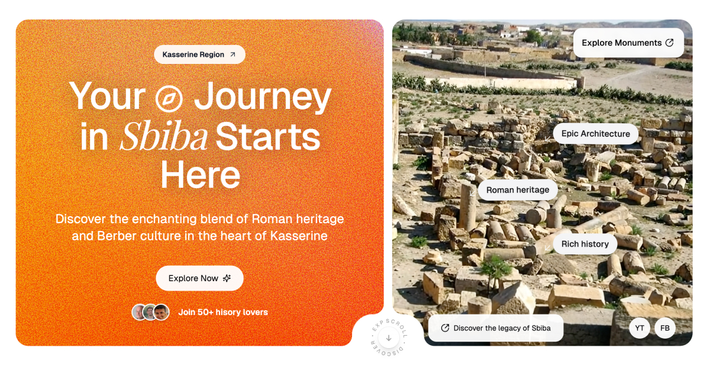

<p align="center">
  
  
</p>

<p align="center" style="margin-top: 20px">
  <p align="center">
    Sbiba Heritage Project - Where Ancient Civilizations Meet
    <br>
    <a href="https://sbiba-heritage.com"><strong>Explore Sbiba »</strong></a>
    <br />
    <br />

  </p>
</p>

## About Sbiba Heritage Project

> "Where ancient Berber wisdom meets Roman grandeur, Sbiba is a living museum of Mediterranean civilizations"

The Sbiba Heritage Project is dedicated to preserving and promoting the rich cultural and historical legacy of the Sbiba region in Kasserine, Tunisia. Our interactive platform showcases the area's archaeological treasures, traditional practices, and the vibrant intersection of Berber, Roman, Byzantine, and Islamic influences that have shaped this remarkable region over millennia.

## Key Features

- **Interactive Historical Timeline**: Explore Sbiba's evolution from prehistoric settlements to modern times-
- **Community Stories**: Listen to oral histories and personal accounts from local residents
- **Educational Resources**: Access curriculum materials for students and researchers
- **Visitor Information**: Practical guides for planning your visit to the Sbiba region

## Historical Significance

Sbiba (ancient Sufes) stands as a testament to Tunisia's rich multicultural heritage:

- **Berber Origins**: Indigenous settlements dating back thousands of years
- **Roman Influence**: Magnificent ruins including temples, baths, and administrative buildings
- **Byzantine Period**: Religious structures and defensive fortifications
- **Islamic Heritage**: Mosques, madrasas, and cultural traditions that continue today
- **Living Traditions**: Ongoing cultural practices that blend ancient wisdom with contemporary life

## Tech Stack

<p align="left">
  <a href="https://nextjs.org"></a>
  <a href="https://react.dev"></a>
  <a href="https://www.typescriptlang.org"></a>
  <a href="https://tailwindcss.com"></a>
  <a href="https://www.prisma.io"></a>
</p>

### Frontend

- [Next.js 15](https://nextjs.org/) - React Framework
- [React](https://react.dev/) - UI Library
- [TypeScript](https://www.typescriptlang.org/) - Programming Language
- [Tailwind CSS](https://tailwindcss.com/) - Styling
- [shadcn/ui](https://ui.shadcn.com/) - UI Components

### Backend & Database

- [PostgreSQL](https://www.postgresql.org/) - Database
- [Prisma](https://www.prisma.io/) - ORM
- [Neon](https://neon.tech/) - Serverless Postgres
- [Auth.js v5](https://authjs.dev/) - Authentication
- [Server Actions](https://nextjs.org/docs/app/api-reference/functions/server-actions) - API Endpoints

### Cloud and AI Services

- [AWS S3](https://aws.amazon.com/s3/) - Media Storage
- [Azure Communication Services](https://azure.microsoft.com/en-us/services/communication-services/) - Email Delivery
- [OpenAI](https://openai.com/) - AI for Text Generation
- [Hume AI](https://www.hume.ai/) - AI for Voice Analysis
- [FAL AI](https://www.fal.ai/) - AI for Image Generation
- [Contentlayer](https://contentlayer.dev/) - Content Management

## Getting Started

### Prerequisites

- Node.js 18.x or higher, or Bun runtime

Important:
This project uses `@t3-oss/env-nextjs` for runtime environment variable validation. The validation schema is defined in `env.mjs` and ensures all required environment variables are present with the correct types.

### Required Environment Variables

The following environment variables must be set in your `.env` file:

#### Authentication

- `AUTH_SECRET`: Secret key for authentication
- `GOOGLE_CLIENT_ID`: Google OAuth client ID
- `GOOGLE_CLIENT_SECRET`: Google OAuth client secret

#### Database

- `DATABASE_URL`: PostgreSQL connection string

#### Media Storage

- `CLOUDINARY_CLOUD_NAME`: Cloudinary cloud name
- `CLOUDINARY_API_KEY`: Cloudinary API key
- `CLOUDINARY_API_SECRET`: Cloudinary API secret

#### Email

- `RESEND_API_KEY`: API key for Resend email service
- `EMAIL_FROM`: Sender email address

#### Application URLs

- `NEXT_PUBLIC_APP_URL`: Public URL of your application
- `NEXTAUTH_URL`: Auth.js URL (optional in production)

### Environment Validation

The project uses strict runtime validation for environment variables:

- Server-side variables are validated before the server starts
- Client-side variables are validated during build time
- Type-safe access to environment variables throughout the application
- Helpful error messages if required variables are missing

### Installation

1. Clone the repository:

```sh
git clone https://github.com/Ashref-dev/sbiba-heritage-project
```

2. Install dependencies:

```sh
npm install
# or
bun install
```

3. Copy the example environment file:

```sh
cp .env.example .env
```

4. Set up your environment variables as listed above

5. Initialize the database:

```sh
npx prisma db push
# or
bunx prisma db push
```

6. Run the development server:

```sh
npm run dev
# or
bun dev
```

## Deployment

<div style="display: flex; gap: 4px;">


</div>

This project is configured for easy deployment on Vercel with a PostgreSQL database.

## Contributing

We welcome contributions from historians, developers, and anyone passionate about preserving cultural heritage! Please see our contribution guidelines for details.

## Contact

For support or inquiries, contact us at heritage@sbiba-heritage.com

## License

This project is licensed under the GNU Affero General Public License v3.0 (AGPL-3.0). See the [LICENSE](LICENSE) file for details.

The AGPL-3.0 license ensures that:

- You can use this software freely
- You can modify and distribute this software
- If you modify and share this software, you must:
  - Make your modifications available under the same license
  - Share the source code when you deploy modified versions
  - Preserve copyright notices and license information

## Project Roadmap

### Phase 1: Core Website Development

- Complete interactive map of historical sites
- Implement virtual tour functionality
- Develop multilingual content system
- Create initial historical database

### Phase 2: Community Engagement

- Add oral history recording and archiving features
- Implement community contribution system
- Develop educational resources for schools
- Create researcher portal with advanced search capabilities

### Phase 3: Tourism Integration

- Develop mobile companion app for on-site visits
- Implement augmented reality features for key monuments
- Create booking system for local guides and accommodations
- Establish partnerships with tourism authorities
